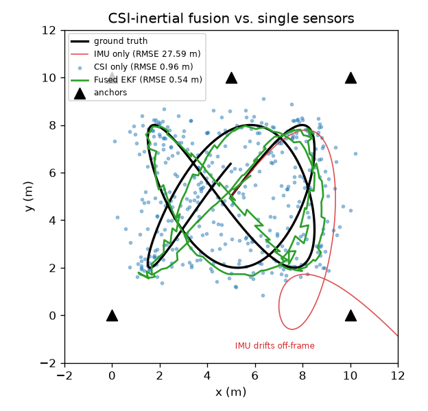
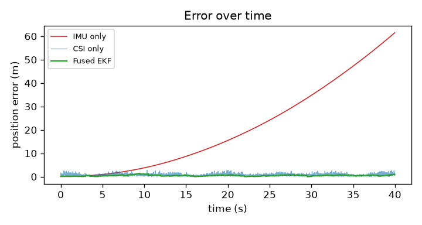

# Wifi CSI Drone navigation

## Research & Reflections

### SpotFi — Kotaru et al.
SpotFi is an indoor localization system built on commodity WiFi
- No extra hardware
-  ~40 cm median accuracy ( better than 6-8 antennas or rotating antenna.)

**How it works:**
Standard WiFi localization either uses RSSI (signal strength), which tops out at 2-4m accuracy, or Angle of Arrival (AoA) estimation, which needs lots of antennas to work well.  SpotFi instead of estimating AoA alone, it jointly estimates AoA *and* Time of Flight (ToF) for each signal path. 
ToF introduces phase shifts across subcarriers (not just across antennas), so by combining subcarrier + antenna data, SpotFi effectively creates a virtual sensor array much larger than the 3 physical antennas. This is fed into a modified MUSIC algorithm (a super-resolution spectral estimation technique) which can then disentangle multiple reflected paths even with limited hardware.

Now, we need to figure out how to identify direct path and indirect path. We do this by comparing statbility, direct path are much much stable, given enough datatset we can identify the stable signal.
But the only issue is drone is constatly moving and vibrating identifyting a stable path is not possible when device itself is under motion.
Finally, it combines direct-path AoA estimates from multiple APs with RSSI measurements to triangulate the target's location.

**What makes sense:**
The insight of using AOA and TOF with reflection is genuinely good. It uses elredy present hardware so no additional cost. The direct path likelihood method is also practical using consistency across packets as a proxy for "this is the real path" is a reasonable heuristic in a static environment.

**Where it breaks down for a moving drone:**
SpotFi's whole direct path identification strategy relies on AoA and ToF estimates being *stable across packets*. That stability assumption completely falls whn the receiver is moving. A drone in flight is constantly changing position, tilting, and vibrating. What SpotFi would see is every path looking "unstable", making it impossible to distinguish the direct path from reflections.

Beyond that, the multipath profile itself changes as the drone moves — reflectors that were relevant a second ago might not be relevant now. The environment is no longer static relative to the receiver, which is the core assumption the whole system is built on.

---

### WiFi Sensing Survey — Ma et al.

CSI is a 3D matrix of complex values (amplitude + phase) across transmit antennas, receive antennas, and subcarriers. It captures how the wireless channel changes due to effects form reflections, diffraction, absorption, scattering. It also changes when people or objects move in the environment.
But he raw measured CSI isn't clean though. It has phase offsets . A lot of the signal processing work in this space is just dealing with those before you can extract anything meaningful.

**The full application landscape:**

The survey groups CSI applications into three buckets:

- **Detection** (binary): Is someone there? Did someone fall? Is there motion?
  Usually threshold based or simple one-class SVM. Doesn't need super clean data.
- **Recognition** (multi-class): What activity? Which gesture? Who is this person?
  Almost always learning-based — SVM, kNN, DTW, CNN, LSTM.
- **Estimation** (continuous values): Where exactly? What direction? Breathing rate?
  Almost always modeling-based — AoA, ToF, Doppler, Fresnel Zone model, MUSIC. These are the most sensitive to noise and require the most signal processing.

Localization falls in the estimation bucket, which is the hardest one. It needs accurate phase and timing information, which is exactly what gets corrupted by hardware offsets and relevant to us by the receiver moving around.

**What makes sense:**
The taxonomy is useful. The paper makes clear that the harder the task (detection → recognition → estimation), the more you depend on clean, well-calibrated signals, and the more fragile things get when conditions change. Localization is at the hardest end.

The survey also notes something directly relevant: most of these systems assume the WiFi device and surrounding environment are either both static, or at most one is moving (a person walking past fixed APs). Nobody has really tackled the case where the *receiver itself* is moving through space.

**Where it breaks down for a moving drone:**

The survey actually mentions drones briefly — as a future opportunity for cross-device WiFi sensing. But that optimism glosses over a real problem. Basically every localization and estimation technique surveyed assumes a static receiver. The
signal processing pipeline (phase offset removal, AoA/ToF estimation, clustering) is designed around the idea that the channel changes because the *environment* changes, not because the receiver itself is flying through it.

On a drone, you get Doppler shifts from the drone's own motion on top of any environmental multipath, vibration from the motors introducing high-frequency noise into the CSI measurements, and the antenna orientation changing continuously as the drone tilts. The signal you're trying to extract and the noise you're trying to remove become very hard to separate.


---

### DeepFi — Wang et al.

DeepFi takes a completely different approach to CSI-based localization compared to SpotFi. Instead of trying to compute geometry (AoA, ToF, triangulation), it treats localization as a fingerprinting problem — collect CSI at known locations,  rain a model on those, then match new CSI readings to the database at inference time.

**The core idea:**
The paper starts from three observations about CSI:
- At a fixed location, CSI is relatively stable over time
- At adjacent locations, CSI looks noticeably different
- The three antennas on an Intel 5300 NIC each give different CSI readings for the same packet — that's useful diversity, not noise to average away
- 
Based on this, they use a Deep Belief Network (DBN) with 4 hidden layers trained on 90 CSI amplitude values per packet (30 subcarriers × 3 antennas). Instead of storing raw CSI as fingerprints, they store the *weights* of the trained network as a compact representation of what the channel looks like at each location. At inference time, they run new CSI through the network, compare reconstruction error across all stored fingerprints, and estimate location as a probability-weighted average using a radial basis function.

Training uses a greedy layer-by-layer algorithm (stacked RBMs with contrastive divergence) to keep things tractable, followed by fine-tuning with backpropagation. 

**Results:**
~0.94m mean error in an open living room, ~1.8m in a cluttered lab environment with lots of NLoS. Both better than RSSI-based methods and the simpler FIFS CSI scheme they compare against.

**What makes sense:**
The fingerprinting framing is quite practical. If you can't do clean geometry, learning a mapping from signal space to location space sidesteps the need for precise AoA/ToF estimates. Deep learning's ability to find non-obvious structure in high-dimensional data is a reasonable fit for CSI, which is exactly that kind of data.

The three-antenna diversity point is also underappreciated in older work averaging across antennas throws away information that the network can actually use.

**Where it breaks down for a moving drone:**
DeepFi's entire premise is that CSI is a stable fingerprint of a location. That's Hypothesis 1 in the paper stable at a fixed spot, variable between spots. A drone violates this almost by definition. The fingerprint at any given "location" will look totally different depending on the drone's orientation, altitude, and the vibration state of its motors at the moment of measurement. 

Even more fundamentally, fingerprinting requires you to have collected training data at (or near) the location you want to localize to. That's manageable for a static device in a known building. For a drone navigating an unmapped space, you'd need to fly the entire environment collecting training data before you could use it, which defeats much of the purpose. And any time the environment changes (someone moves furniture, opens a door), you'd need to recollect.

The method also only uses CSI amplitude, discarding phase entirely because of calibration difficulties. Which is just throwing off extra information in my opinion,

---

## Experimentation

Two experiments, in `/code`, that walk from "here's why CSI alone fails on a
drone" to "here's what I'd actually build instead."

### Experiment 1 — static fingerprinting hits a wall (`csi_localization.py`)

I used a public per-location CSI dataset ([qiang5love1314](https://github.com/qiang5love1314/CSI-dataset-for-indoor-localization))
of amplitude fingerprints, pulled simple features (mean & std of amplitude over
3 antennas × 30 subcarriers, 180 dims, in 50-packet windows), and ran
RandomForest / kNN on three tasks. Full write-up in [`code/results/`](code/results/README.md).

| Task | Classes | Accuracy | Split |
|------|---------|----------|-------|
| Room ID | 4 | **63%** | grouped (honest) |
| Lab zone (3×3) | 9 | **17%** (~random) | grouped (honest) |
| Lab exact coord | 317 | 99.7% | random (leaky — flagged) |

Rooms are separable; sub-meter localization inside one room is basically random
once you use an honest split that keeps a location on one side of train/test.
The 99.7% is memorization from window leakage, not generalization. This is the
static-receiver ceiling, and a moving/tilting/vibrating drone only makes it
worse — it violates the one assumption (a location has a stable fingerprint)
that every method here leans on.

### Experiment 2 — what I'd actually build (`csi_inertial_fusion.py`)

If CSI alone can't localize a moving drone, the fix is to stop asking it to. The
design comes from three ideas, which turn out to be **one architecture**:

1. **Use the onboard IMU** — but an IMU senses *motion*, not location. Integrate
   it and the error grows quadratically; it drifts meters in seconds. It's a
   component, not a localizer.
2. **Put the receiver off the drone** — make the drone a *transmitter* and let
   fixed anchors at known positions do the CSI ranging. Now the receiver is
   *static* again, which is the exact regime SpotFi/DeepFi need. This is what
   makes CSI reliable under drone motion.
3. **Start from a known point, fuse IMU + CSI** — the IMU carries a smooth,
   high-rate estimate between the sparse, noisy CSI fixes; the CSI fixes bound
   the IMU's drift. This is a Kalman filter, and structurally it's just
   visual-inertial odometry with CSI swapped in for the camera — the same trick
   the drone already uses when cameras work.

So: **drone-as-transmitter → off-board anchors give CSI range fixes → fused with
the onboard IMU in an EKF, from a known start.** Idea 1 is the IMU input, idea 2
is where the absolute fix comes from, idea 3 is the filter that ties them.

`csi_inertial_fusion.py` simulates this on a 40 s flight (50 Hz IMU with a
realistic bias, CSI fixes at 2 Hz from 5 anchors). Crucially, the CSI ranging
noise **grows with the drone's speed** — the README's own thesis (Doppler,
vibration, and tilt corrupt CSI under motion) made quantitative.

| Estimator | RMSE | Note |
|-----------|------|------|
| IMU only (dead reckoning) | **27.6 m** | drifts off-frame, 61 m final error |
| CSI only (multilateration) | **0.96 m** | anchored but noisy, jitters |
| **Fused EKF** | **0.54 m** | 44% better than the best single sensor |




The error-vs-time plot is the whole point in one figure: the IMU curve blows up
quadratically while the fused curve stays flat and bounded. Each sensor covers
the other's weakness — IMU is smooth-but-drifts, CSI is anchored-but-noisy.

**Caveat:** this is a simulation with hand-chosen noise models, not real drone
CSI. The value is in the *architecture* and the failure modes it targets; every
place a real ToF/AoA CSI stream or accelerometer would plug in is marked in the
code.

### The forward-looking twist — motion as signal, not noise

Every paper (and my Part 1 write-up) treats the drone's motion as *noise* to be
removed. It can be flipped: motion-induced **Doppler in CSI encodes velocity**.
Instead of fighting the Doppler shift, measure it and use it as a second
velocity estimate that cross-checks the IMU — turning the biggest liability into
an extra sensor. That's the natural next step beyond this proof of concept.

### Other approaches I considered

The EKF above is the *infrastructure-based, filter-based* design — the safe
default, but it assumes you can pre-install and survey anchors. That's fine for
a known warehouse, fatal for a truly unmapped one. The alternatives below are
really about relaxing that one assumption, or swapping the estimator for one
that handles a failure mode the EKF can't. I didn't build these; this is the map
of the space.

| Approach | Removes constraint | Absolute pos? | Unmapped space? | Trade-off |
|---|---|---|---|---|
| **EKF + anchors** (built) | — | Yes | No | Needs surveyed anchors |
| **CSI-SLAM** | known anchors | drift-corrected | **Yes** | Online radio map + loop closure; noisy, hardest |
| **Learned end-to-end** (CSI+IMU→pose) | ranging geometry | Yes | No | Learns drone-specific artifacts; needs heavy training data, poor cross-env transfer |
| **Doppler odometry** | anchors entirely | relative only | Partial | "Motion as signal" (above); no absolute reference, best paired with another method |
| **Particle filter + fingerprint** | Gaussian/unimodal assumption | Yes | No | Represents multimodal CSI ambiguity ("here OR there") until motion disambiguates — the EKF's blind spot; reuses Exp-1 fingerprints |
| **Factor-graph smoothing** | single-step linearization | Yes | No | Batch-optimizes a pose window (modern VIO/SLAM backbone); better accuracy, more compute — a natural v2 of the EKF |
| **Multi-sensor redundancy** | single-sensor fragility | Yes | Partial | CSI + UWB + baro + magnetometer + optical flow; least elegant, most robust in a real dusty warehouse |

**How I'd sequence them:** the EKF is v1. The two highest-insight follow-ups are
the **particle filter** (directly fixes the EKF's inability to resolve
multimodal CSI multipath, and reuses the fingerprints from Experiment 1) and
**Doppler odometry** (the anchor-free, motion-as-signal idea). **CSI-SLAM** is
the ceiling — it's the only one that answers the prompt's "unmapped dusty
warehouse" head-on — but it's well past a 6-hour build.

---

## Code
```/code```
- `csi_localization.py` — Experiment 1: static CSI fingerprinting classifiers
- `csi_inertial_fusion.py` — Experiment 2: CSI + IMU EKF fusion for a moving drone
- `results/` — outputs, plots, and detailed notes
